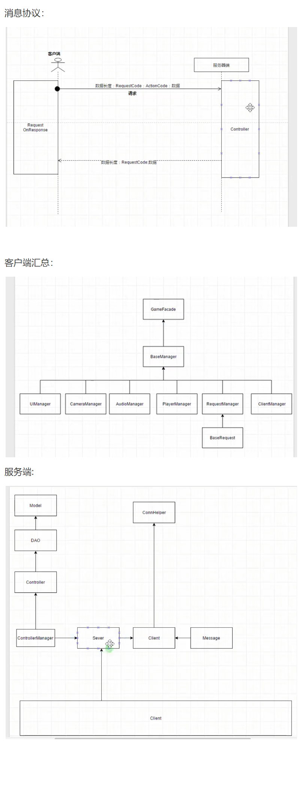
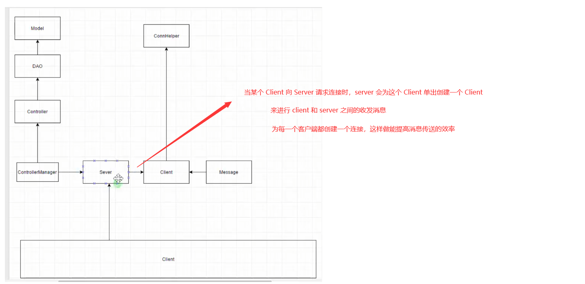
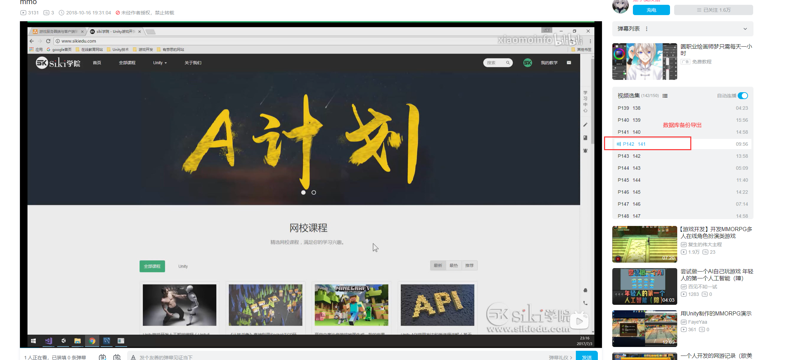

 

+ 服务器

  - Server  用来创建 TCP 中的 Socket ，监听客户端的连接
  - ConnHelper  工具类，用来连接数据库
  - Controller  处理客户端的请求，客户端的请求发送给 Server，Server 会调用相应的 Controller 来进行处理
  - Model 与数据库中的表对应，一个 Model 对应数据库中的一个表
  - DAO(Data Access Object) 数据访问对象，用来操作数据库

# 项目中对SQL数据库引用

# gitee仓库私人令牌

8ccd4ff0fbad6a1b67dca8595b67cccc