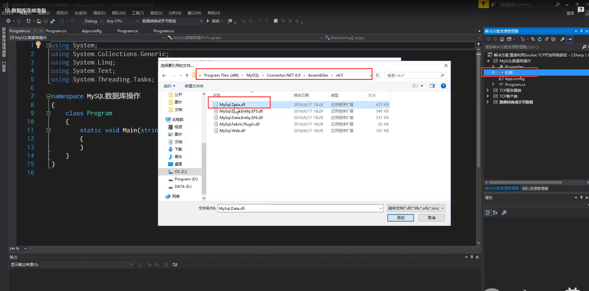

 客户端的 Request 用于请求的发起和请求的响应  服务器端的 controller 用于处理客户端的请求和给客户端响应   详细解释在视频教程 p29

+ 服务器

  - Server  用来创建 TCP 中的 Socket ，监听客户端的连接
  - ConnHelper  工具类，用来连接数据库
  - Controller  处理客户端的请求，客户端的请求发送给 Server，Server 会调用相应的 Controller 来进行处理
  - Model 与数据库中的表对应，一个 Model 对应数据库中的一个表
  - DAO(Data Access Object) 数据访问对象，用来操作数据库

# 项目中对SQL数据库引用

# gitee仓库私人令牌

8ccd4ff0fbad6a1b67dca8595b67cccc

# 添加新 UI Panel 需要添加的地方

# 有时间可了解

+ DoTween 的使用
+ 工程中的 UI 面板管理框架

# 游戏设计

每个厨具摆放在不同位置，分别可以做出不同的菜，玩家需要走到对应的地方进行做菜，等待进度条结束后取餐上菜

简化流程

切萝卜 煮汤 上菜 得分    两个砧板 两个锅  玩家用同一个  头上标注p1 (房主)    p2  

# GIT 笔记

# 毕业论文

+ 40- 50 页
+ 5 章    格式跟书一样
+ 1.绪论 背景 研究意义和目的  2.用到的技术 基础知识   3.需求分析  4.设计 划分的模块（34可以放一块 与具体的语言没关系）5.实现 与具体的语言有关系 需要把语言截图出来
