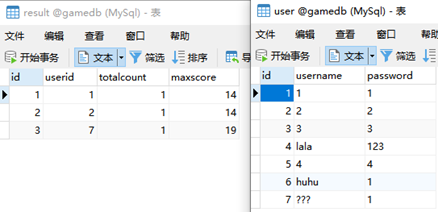
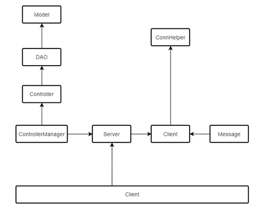
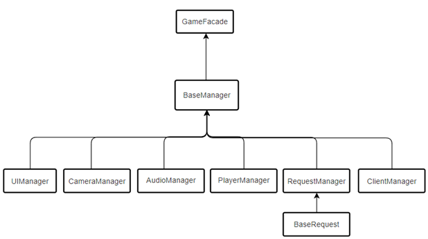
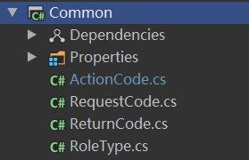
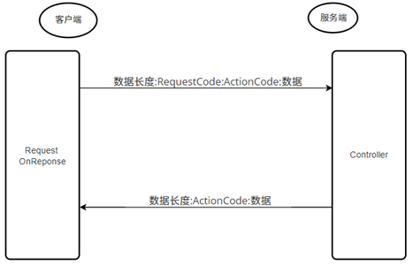

# HappyRestaurant

#### 介绍

**毕业设计（基于unity的餐厅经营游戏）**
       本毕业设计开发了一款可以联机的餐厅经营游戏。使用Unity作为游戏开发引擎，编程语言为c#，TCP/IP来进行客户端与服务端之间的网络通讯，MySQL作为数据库来存放游戏中的数据，使用Blender来进行游戏人物和场景的建模。游戏共创建了服务端、客户端、共享工程三个工程，服务端负责管理数据库，根据客户端的需求进行数据的计算和转发，客户端则根据服务端发送的数据来控制游戏中的数据变化，共享工程则是用来存放客户端和服务端共同使用的方法和变量。三个项目互相配合，实现了一款可以联机的餐厅经营游戏。
      为了实现联机功能，服务端作为中介，负责接收客户端的状态并发送给房间内的其他客户端，实现房间内所有客户端之间的信息同步，以实现联机的效果。
在游戏的框架设计中，核心思想是用静态类来存放公用的变量和方法，也称“单例模式”。如果需要类与类之间方法的调用，则使用这个静态类作为中介，将方法放入静态类中，通过使用静态类来进行调用，这种做法大大降低了代码的耦合性，减少了代码结构调整时的工作量，代码的结构也更加整洁。

#### 游戏模块设计

**数据库**

​      根据游戏需求，使用MySql创建了游戏的数据库，数据库中创建了名为user和result的两张表，user表来存放所有玩家用户名和密码，result表用来存放玩家的进行游戏的总场数和最高得分，创建的两张表如下图所示。

**服务端**

​      根据游戏需求，服务端的模块划分如下：

（1）Server：用来创建TCP中的Socket，监听客户端的连接。

（2）ConnHelper：工具类，用来连接数据库。

（3）Controller：不同的Controller分别负责处理客户端的不同类型请求，每当客户端的请求发送给Server，Server会调用相应的Controller来进行处理。

（4）ControllerManager：管理所有Controller。

（5）Model：与数据库中的表对应，一个Model对应数据库中的一个表。

（6）DAO（Data Access Object）：数据访问对象，用来操作数据库。

（7）ConnHelper：用于将服务端与数据库进行连接。

（8）Client：当某个Client向Server请求连接时，server会为这个Client单出创建一个Client来进行Client和Server之间的收发消息。为每一个客户端都创建—个与服务端的连接，这样做能提高消息传送的效率。

（9）Message：管理服务端客户端之间传送的消息，包括消息的解析、读取以及打包等操作。

**客户端**

​      根据游戏需求，客户端的模块划分如下：

（1）GameFacade：管理所有的 Manager，作为不同 Manager 之间互相访问数据和方法的中介。

（2）UIManager：管理游戏中的所有面板UI。

（3）CameraManager：管理游戏中的相机移动。

（4）AudioManager： 管理游戏中的音效的播放。

（5）PlayerManager：管理游戏中的玩家，包括玩家的生成以及初始化等操作。

（6）RequestManager：储存和管理所有的 request 请求并对 request 进行处理。

（7）BaseRequest：所有 Request 类的父亲，用于存放 Request 类公用的属性和方法。

（8）ClientManager：用来管理客户端跟服务器端的Socket连接。

**网络通讯**

（1）共享工程

创建了一个名为Common的共享工程，如下：

​      其中ActionCode类通过枚举来储存所有的ActionCode类型；RequestCode类通过枚举来储存所有的RequestCode类型；ReturnCode类通过枚举储存客户端与服务端的响应类型；RoleType类通过枚举来储存所有的角色类型。

（2）消息协议

​      通过服务端和客户端都有引用的共享工程，从而实现消息协议：在客户端与服务端之间进行消息通讯时，需要给消息制定规范：项目中将客户端向服务端发送的请求消息分为四段：数据长度 + RequestCode + ActionCode + 数据，首部用一个字节的空间来存储要发送的消息总长度，接着是表示Controller类型的 RequestCode，然后是在Controller中需要执行的方法名ActionCode。最后的具体需要传送的数据，例如登录操作时，客户端需要想服务器发送用户输入的用户名和密码来进行核验，其中的用户名和密码就是具体要发送的数据。ActionCode同样也代表了客户端的响应函数名，在客户端使用RequestManager将所有的ActionCode用字典保存起来，因此服务端只需要传送ActionCode，然后通过字典查找就能找到客户端的响应函数，从而服务端发送的消息只需要ActionCode，而不需要传送Controller的类型RequestCode了，这是客户端与服务端两者的设计区别。